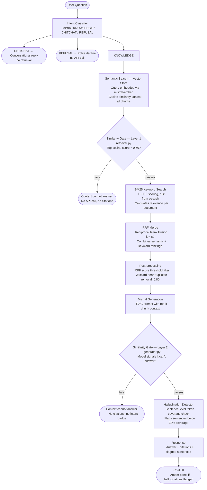
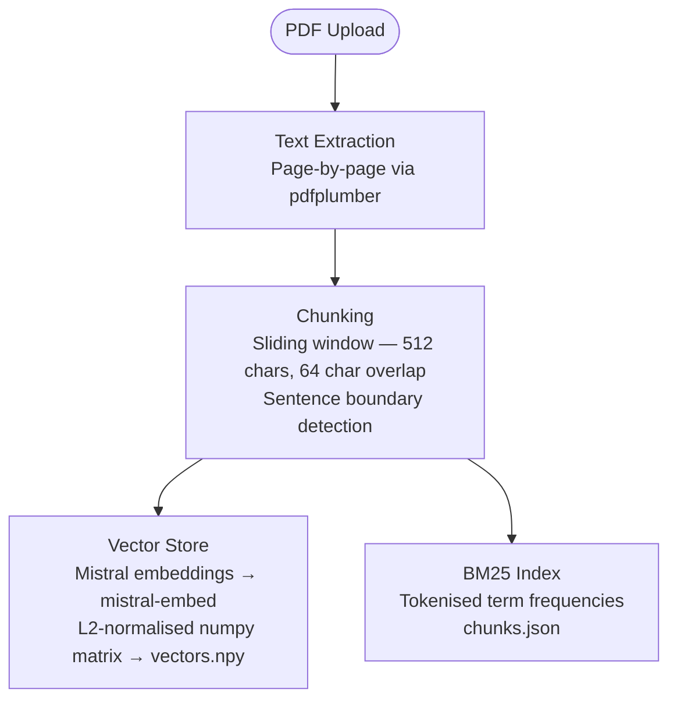

# StackAI-RAG

RAG pipeline with PDF upload, hybrid search, hallucination detection, and a chat UI. Built with FastAPI and Mistral AI. No external search libraries, no vector database frameworks, no RAG frameworks.

---

## Workflow

PDFs are uploaded via the ingest endpoint. The system extracts text page by page, splits it into overlapping chunks, embeds each chunk using Mistral's embedding model, and indexes them in two ways — a vector store for semantic search and a BM25 index for keyword search.

When a user asks a question, the system classifies the intent and decides whether to search the knowledge base at all. If yes, both searches are executed, their results are merged and re-ranked, and the evidence is checked for quality before calling Mistral to generate a response grounded in the retrieved chunks.

Before returning the answer, a hallucination detector scans each sentence against the source material. Sentences with low token coverage against the retrieved chunks are flagged, removed from the answer, and surfaced to the user in a separate panel with an explanation.

If the retrieved context doesn't contain enough information to answer the question, the system returns a clean "can't answer" response with no citations.

Every question and answer is automatically logged to `storage/chat_log.json`. The full session can be exported as a Markdown file or PDF from the chat UI.

---

## Project Structure

```
StackAI-RAG/
├── app/
│   ├── main.py               # FastAPI app, CORS, static files, /health
│   ├── config.py             # All settings: similarity threshold, top_k, chunk params
│   ├── api/
│   │   ├── ingest.py         # POST /ingest — PDF upload and indexing
│   │   └── query.py          # POST /query — question answering, response schema, chat log
│   ├── core/
│   │   ├── models.py         # Shared types (SearchResult, Chunk)
│   │   ├── vector_store.py   # In-memory cosine similarity search via Mistral embeddings
│   │   └── keyword_index.py  # BM25 keyword search; tokenize() is reused by hallucination detector
│   └── services/
│       ├── ingestion.py       # PDF extraction and sliding-window chunking
│       ├── query_processor.py # Intent classification (KNOWLEDGE / CHITCHAT / REFUSAL) and query rewriting
│       ├── retriever.py       # Hybrid search + similarity gate (Layer 1)
│       ├── postprocessor.py   # RRF score threshold filter and Jaccard near-duplicate removal
│       └── generator.py       # Answer generation, similarity gate (Layer 2), hallucination detector
├── ui/
│   └── index.html             # Single-page chat interface — no frameworks, vanilla JS
├── storage/                   # Persisted indexes and chat log — gitignored
│   ├── vectors.npy            # Chunk embedding matrix
│   ├── chunks.json            # Chunk metadata for BM25 index
│   └── chat_log.json          # Append-only Q&A session log
├── .env                       # Environment variables — API key and all config (gitignored)
├── start.sh                   # Quick-start script
└── requirements.txt
```

---

## Architecture

### Query Pipeline



### Ingest Pipeline



---

## Chat UI

The Stack RAG frontend is a single-page HTML/CSS/JS chat interface with a function for you to upload multiple PDF documents. It also has the ability to toggle between light and dark modes, and an option to save chat as a JSON or a PDF file. Accessable at the root URL (`http://localhost:8000`). 

**Left sidebar:**
- Drag-and-drop PDF upload and supports multiple files
- Document list showing filenames and chunk counts after upload
- Clear knowledge base button

**Right chat area:**
- Message bubbles (user on the right, assistant on the left)
- Typing indicator (bouncing dots) while waiting for a response
- Intent badges below each response — `knowledge`, `chitchat`, or `refusal`
- Source citation badges showing filename and page number

**Response formatting:**
- Responses render with proper markdown — bold, italic, bullet points, numbered lists
- Lists are only used when the user explicitly asks for them; default responses are plain prose
- Citation markers like `[1]`, `[2]` are stripped from Mistral's output for aesthetic cleanliness

**Hallucination flagging**
- When the hallucination filter removes sentences from a response, an amber panel appears below the answer listing each dropped sentence, the percentage of its terms found in the source material, and the specific words the model introduced that don't appear in any retrieved chunk

**Export Chat:**
- A button in the top-right header exports the full session
- **Download Markdown** — saves a `.md` file with all questions, answers, citations, and flagged sentences
- **Export as PDF** — opens a formatted print page and triggers the browser print function (just like your command + p on MacOS)

**Dark Mode:**
  Toggle button in the top-right header switches between light and dark themes

---

## Getting Started

### 1. Clone and set up

```bash
git clone <repo-url>
cd StackAI-RAG
python3 -m venv .venv
source .venv/bin/activate
pip install -r requirements.txt
```

### 2. Configure environment

```bash
# Open .env and set your MISTRAL_API_KEY — all other values have sensible defaults
```

### 3. Run the server

```bash
uvicorn app.main:app --reload
```

Server starts at `http://localhost:8000`. The chat UI loads at the root URL. Hit `/health` to confirm it's up.

---

## Configuration

Tunable parameters for Stack RAG live in `.env`. All variables except `MISTRAL_API_KEY` have sensible defaults and are pre-configured.

| Variable | Default | What it controls |
|----------|---------|-----------------|
| `MISTRAL_API_KEY` | — | Required. Your Mistral AI API key |
| `CHUNK_SIZE` | 512 | Characters per text chunk when splitting PDFs |
| `CHUNK_OVERLAP` | 64 | Overlap between consecutive chunks to preserve context |
| `TOP_K` | 5 | Number of chunks retrieved per query |
| `SIMILARITY_THRESHOLD` | 0.60 | Minimum cosine score — below this, the query is rejected as off-topic |
| `STORAGE_DIR` | ./storage | Where vector index, BM25 index, and chat log are saved |

**Defaul Settings**

`CHUNK_SIZE 512` — 512 chars covers roughly a paragraph or two, suitable for most document types.

`CHUNK_OVERLAP 64` — Just over 10% of chunk size. Sentences that fall on a boundary don't get cut in half semantically — the overlap carries them into the next chunk.

`TOP_K 5` — Retrieves 5 chunks per query. Can be increased for broad research questions or lowered for more focused answers.

`SIMILARITY_THRESHOLD 0.60` — Mistral's dense embeddings compress everything into a narrow cone; issue is that unrelated queries can score 0.40 – 0.55 cosine similarity. 0.60 sits above that noise floor and below typical on-topic scores (0.65+), making the gate meaningful. Below this score the system returns "The context provided cannot answer this question." with no citations.

---

## API

### Ingest

**`POST /api/ingest`**
Upload one or more PDF files into the knowledge base.

```bash
curl -X POST http://localhost:8000/api/ingest \
  -F "files=@report.pdf" \
  -F "files=@handbook.pdf"
```

Response:
```json
{
  "files_processed": 2,
  "total_chunks": 34,
  "results": [
    { "filename": "report.pdf", "chunks": 20 },
    { "filename": "handbook.pdf", "chunks": 14 }
  ]
}
```

**`DELETE /api/ingest`**
Wipe the entire knowledge base and start fresh.

```bash
curl -X DELETE http://localhost:8000/api/ingest
```

---

### Query

**`POST /api/query`**
Ask a question against the uploaded documents.

```bash
curl -X POST http://localhost:8000/api/query \
  -H "Content-Type: application/json" \
  -d '{"query": "What were the Q3 earnings?"}'
```

Optional `top_k` parameter (1–20) overrides the default number of chunks retrieved:

```bash
curl -X POST http://localhost:8000/api/query \
  -H "Content-Type: application/json" \
  -d '{"query": "What were the Q3 earnings?", "top_k": 3}'
```

Response:
```json
{
  "answer": "Q3 net revenue reached 4.2 billion, up 12% year over year.",
  "intent": "knowledge",
  "citations": [
    { "source": "annual_report.pdf", "page": 4 }
  ],
  "original_query": "What were the Q3 earnings?",
  "rewritten_query": "What were the Q3 earnings figures?",
  "flagged_sentences": []
}
```

`flagged_sentences` is active when the hallucination detector removes sentences from the Mistral-genearted answer. Each entry contains the sentence, its token coverage score, and the list of unsupported terms.

The `intent` field is either `knowledge`, `chitchat`, or `refusal`. Citations are only returned for `knowledge` responses where the context was sufficient to answer. The `knowledge` badge is hidden in the UI when no citations are present so it looks lean and to avoid an off-topic question still receivnig citations (this is an aesthetic and UI choice on my end)


---

### Similarity Gate (Two-Layer)

Goal of this is to prevent sytem from answering questions that uploaded documents does not support. There's a pre-retrieval layer and post-generation layer. 

**Layer 1 — Pre-retrieval (`app/services/retriever.py`)**
After the semantic search runs, the top cosine similarity score is checked against `SIMILARITY_THRESHOLD` (default 0.60) before further processing. If the best-matching chunk in the knowledge base scores below this threshold, the query is off-topic and an empty result is returned immediately — no keyword search, no RRF merge, no Mistral generation call — This is the cheapest possible rejection.

The threshold is set at 0.60 because of Mistra's embedding model known as the embedding cone problem. During testing the threshold was set at 0.30 and the system would not flag anything as off-topic. To remedy this, different values were tested and 0.60 struck the sweet spot. With Mistral, dense embeddings don't distribute evenly across vector space — all text gets compressed into a narrow cluster, so unrelated queries can easily score 0.40–0.55 cosine similarity against any document. A threshold below 0.60 would effectively never fire. 0.60 sits above that noise floor while remaining below typical on-topic scores of 0.65 and above.

**Layer 2 — Post-generation (`app/services/generator.py`)**
Some queries pass Layer 1 because their topic is related, but the specific answer isn't present in the retrieved chunks. For example, asking about Q4 results when only Q1–Q3 data was uploaded for a company's report. The similarity score is high, but the specific fact is missing. Layer 1 cannot detect this — only the model can, after reading the actual chunk text.

After Mistral generates a response, the text is scanned for 15 indicator phrases such as *"does not contain"*, *"no information"*, *"cannot answer"*, *"not mentioned"*, and *"outside the scope"*. If any match, the model is signalling the context wasn't sufficient. Both layers return the same unified message with no citations and no intent badge for clealiness and aesthetic purposes: *"The context provided cannot answer this question."*

---

### Hallucination Detector

The hallucination detector is a post-generation filter that identifies specific claims in Mistral's answer that aren't supported by the retrieved source material. It lives in `app/services/generator.py` and runs on every genuine knowledge answer after the similarity gate passes.

**How it works:**

1. A vocabulary is built from all retrieved chunk text — every meaningful content word (stopwords excluded, lowercased) that actually appears in the source material the model was given.

2. The generated answer is split into individual sentences.

3. Each sentence is first checked against a list of meta-phrases. Sentences that reference the source material itself (*"the context"*, *"the document"*, *"the paper"*) or describe the absence of information (*"does not explicitly"*, *"not provided"*, *"not mentioned"*) are exempted entirely.

4. Remaining sentences (positive factual assertions) are scored by token coverage: what fraction of the sentence's content words appear in the chunk vocabulary. Sentences below 30% coverage are flagged. This is also a tested result as any higher, correct information are flagged, and too low, blatant errors are passed as correct.

5. Flagged sentences are removed from the answer. For each one, the system records the coverage percentage and the specific unsupported terms — the words the model introduced that don't appear anywhere in the retrieved chunks.

**Why token coverage works as a hallucination signal:**
When Mistral answers correctly from PDF context, the vocabulary of the answer closely mirrors the vocabulary of the chunks it was given. When it hallucinates — inventing a specific number, citing the wrong section, attributing a claim to an author, adding a detail that wasn't there — the terms it introduces won't appear in the chunk vocabulary, pulling the coverage score down.


---

## Dependencies

All nine packages in `requirements.txt` — no RAG frameworks, no vector database clients, no NLP libraries.

| Package | Role |
|---------|------|
| `fastapi` | Web framework and API routing |
| `uvicorn[standard]` | ASGI server |
| `python-multipart` | Multipart form parsing for PDF upload |
| `pdfplumber` | PDF text extraction, page by page |
| `numpy` | Matrix operations for cosine similarity search |
| `mistralai` | Mistral embeddings (`mistral-embed`) and generation (`mistral-small-latest`) |
| `python-dotenv` | `.env` file loading |
| `pydantic` | Request and response model validation |
| `pydantic-settings` | Settings class with environment variable binding |

BM25, tokenisation, RRF merging, sliding-window chunking, near-duplicate removal, and the hallucination detector are all implemented from scratch with no additional dependencies.
